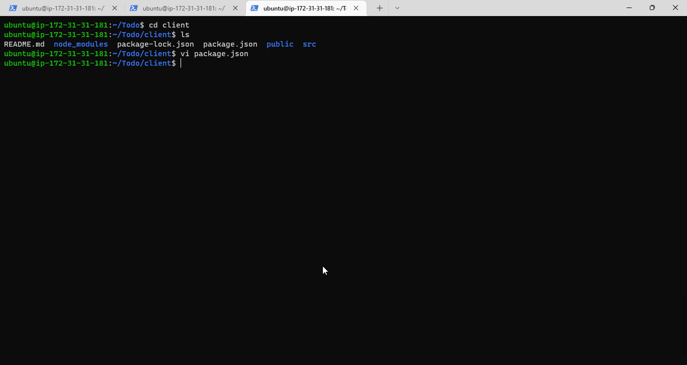

## PROJECT 3: MERN STACK IMPLEMENTATION
### SIMPLE TO-DO APPLICATION ON MERN WEB STACK

### STEP 1 – BACKEND CONFIGURATION

#### I'm to Update ubuntu with the command below
`sudo apt update`

#### I'm to upgrade ubuntu server with the command below
`sudo apt upgrade`

#### Lets Install Node.js on the server
#### Install Node.js with the command below

`sudo apt-get install -y nodejs`

#### The command above installs both nodejs and npm. NPM is a package manager for Node like apt for Ubuntu, it is used to install Node modules & packages and to manage dependency conflicts.Verify the node installation with the command below

`node -v `

#### Verify the node installation with the command below

`npm -v `

#### Create a new directory for your To-Do project:
`mkdir Todo`

#### Run the command below to verify that the Todo directory is created with ls command
`ls`

#### Now lets change our current directory to the newly created one:

`cd Todo`

#### Next,  I you will use the command npm init to initialise my project, so that a new file named package.json will be created. This file will normally contain information about my application and the dependencies that it needs to run. I will follow the prompts after running the command. I will press Enter several times to accept default values, then accept to write out the package.json file by typing yes.

`npm init`

#### I will run the command ls to confirm that I have package.json file created. Next, I will Install ExpressJs and create the Routes directory.

## INSTALL EXPRESSJS

#### To use express, I will install it using npm:

`npm install express`

#### Now create a file index.js with the command below

`touch index.js`

#### Install the dotenv module

`npm install dotenv`

#### Open the index.js file with the command below

`vim index.js`

#### Notice that I have specified to use port 5000 in the code. This will be required later when I go on the browser.

#### Now it is time to start our server to see if it works. I Open my terminal in the same directory as my index.js file and type:

`node index.js`

#### Now I see my Server running on port 5000 in my terminal

#### I have enable port 80 on my AWS security group in other to access my server on the web

#### I Open up my browser and try to access my server’s Public IP or Public DNS name followed by port 5000:

#### Routes
#### There are three actions that our To-Do application needs to be able to do:

#### 1. Create a new task
#### 2. Display list of all tasks
#### 3. Delete a completed task
#### Each task will be associated with some particular endpoint and will use different standard HTTP request methods: POST, GET, DELETE.

#### For each task, we need to create routes that will define various endpoints that the To-do app will depend on. So let us create a folder routes

`mkdir routes`

#### Change directory to routes folder.
`cd routes`

#### Now, create a file api.js with the command below
`touch api.js`

#### Open the file with the command below

`vim api.js`

## MODELS

#### Since the app is going to make use of Mongodb which is a NoSQL database, we need to create a model. A model is at the heart of JavaScript based applications, and it is what makes it interactive. l will also use models to define the database schema . This is important so that we will be able to define the fields stored in each Mongodb document. In essence, the Schema is a blueprint of how the database will be constructed, including other data fields that may not be required to be stored in the database. These are known as virtual properties. To create a Schema and a model, I will install mongoose which is a Node.js package that makes working with mongodb easier. I will change directory back to Todo folder with cd .. and install Mongoose

`npm install mongoose`

#### I will Create a new folder models :

`mkdir models`

#### I will change directory into the newly created ‘models’ folder with
`cd models`

#### Inside the models folder, I will create a file and name it todo.js

`touch todo.js`

#### I Open the file and create with vim todo.js then paste the code:

#### Now we need to update my routes from the file api.js in ‘routes’ directory to make use of the new model. In Routes directory, I open api.js with vim api.js, I delete the code inside with :%d command and paste there code into it then save and exit.

## MONGODB DATABASE

#### We need a database where we will store our data. For this we will make use of mLab. mLab provides MongoDB database as a service solution (DBaaS), so to make life easy, you will need to sign up for a shared clusters free account, which is ideal for our use case.

#### In the index.js file, I specified process.env to access environment variables, but I have not yet created this file. So I need to do that now. I Create a file in my Todo directory and name it .env.

`touch .env vi .env`

#### I Ensure to update <username>, <password>, <network-address> and <database> according to your setup

#### Now that I need to update the index.js to reflect the use of .env so that Node.js can connect to the database. I Simply delete existing content in the file, and update it with the entire code below.

`const express = require('express');
const bodyParser = require('body-parser');
const mongoose = require('mongoose');
const routes = require('./routes/api');
const path = require('path');
require('dotenv').config();

const app = express();

const port = process.env.PORT || 5000;

//connect to the database
mongoose.connect(process.env.DB, { useNewUrlParser: true, useUnifiedTopology: true })
.then(() => console.log(`Database connected successfully`))
.catch(err => console.log(err));

//since mongoose promise is depreciated, we overide it with node's promise
mongoose.Promise = global.Promise;

app.use((req, res, next) => {
res.header("Access-Control-Allow-Origin", "\*");
res.header("Access-Control-Allow-Headers", "Origin, X-Requested-With, Content-Type, Accept");
next();
});

app.use(bodyParser.json());

app.use('/api', routes);

app.use((err, req, res, next) => {
console.log(err);
next();
});
app.listen(port, () => {
console.log(`Server running on port ${port}`)
});`

#### Using environment variables to store information is considered more secure and best practice to separate configuration and secret data from the application, instead of writing connection strings directly inside the index.js application file.

#### I Start your server using the command:

`node index.js`

## Testing Backend Code without Frontend using RESTful API
#### So far I have written backend part of our To-Do application, and configured a database, but I do not have a frontend UI yet. I need ReactJS code to achieve that. But during development, I will need a way to test my code using RESTfulL API. Therefore, I will need to make use of some API development client to test my code.

#### In this project, I will use Postman to test our API.

## Frontend creation
#### Since i'm done with the functionality I want from my backend and API, it is time to create a user interface for a Web client (browser) to interact with the application via API. To start out with the frontend of the To-do app, I will use the create-react-app command to scaffold my app.

#### In the same root directory as my backend code, which is the Todo directory, run:

`npx create-react-app client`

#### This will create a new folder in my Todo directory called client, where I will add all the react code.

## Running a React App
#### Before testing the react app, there are some dependencies that need to be installed.

#### 1. I will Install concurrently. It is used to run more than one command simultaneously from the same terminal window.
`npm install concurrently --save-dev`

#### Install nodemon. It is used to run and monitor the server. If there is any change in the server code, nodemon will restart it automatically and load the new changes.
`npm install nodemon --save-dev`

#### In Todo folder open the package.json file. Change the highlighted part of the below screenshot and replace with the code below.

`"scripts": { "start": "node index.js" "start-watch": "nodemon index.js", "dev": "concurrently \"npm run start-watch\" \"cd client && npm start\"" },`

#### Add the key value pair in the package.json file "proxy": "http://localhost:5000".
#### The whole purpose of adding the proxy configuration in number 3 above is to make it possible to access the application directly from the browser by simply calling the server url like http://localhost:5000 rather than always including the entire path like http://localhost:5000/api/todos

#### Now, I ensure i'm inside the Todo directory, and simply do:

`npm run dev`

#### My app open and start running on localhost:3000

#### Important note: In order to be able to access the application from the Internet I open TCP port 3000 on EC2 by adding a new Security Group rule.

## Creating your React Components
#### One of the advantages of react is that it makes use of components, which are reusable and also makes code modular. For my Todo app, there will be two stateful components and one stateless component.
#### From my Todo directory I run

`cd client`

#### I move to the src directory
`cd src`

#### Inside src folder I create another folder called components

`mkdir components`

####  Move into the components directory with

`cd components`

#### Inside ‘components’ directory create three files Input.js, ListTodo.js and Todo.js.

`touch Input.js ListTodo.js Todo.js`

#### Open Input.js file

`vi Input.js`

#### To make use of Axios, which is a Promise based HTTP client for the browser and node.js, I need to cd into my client from my terminal and run yarn add axios or npm install axios. I Move to the src folder.

`cd ..`

#### Install Axios

`npm install axios`

#### Go to ‘components’ directory

`cd src/components`

#### After that open your ListTodo.js

`vi ListTodo.js`

#### I need to make little adjustment to my react code. I Delete the logo and adjust our App.js. Move to the src folder.

`cd ..`
`vi App.js`

#### Exit In the src directory open the index.css

`vim index.css`

#### I Go to the Todo directory using this command

`cd ../..`

#### When I get to Todo directory I run:

`npm run dev`

#### No errors when saving all these files, my To-Do app is ready and fully functional with the functionality discussed earlier: creating a task, deleting a task and viewing all my tasks.

